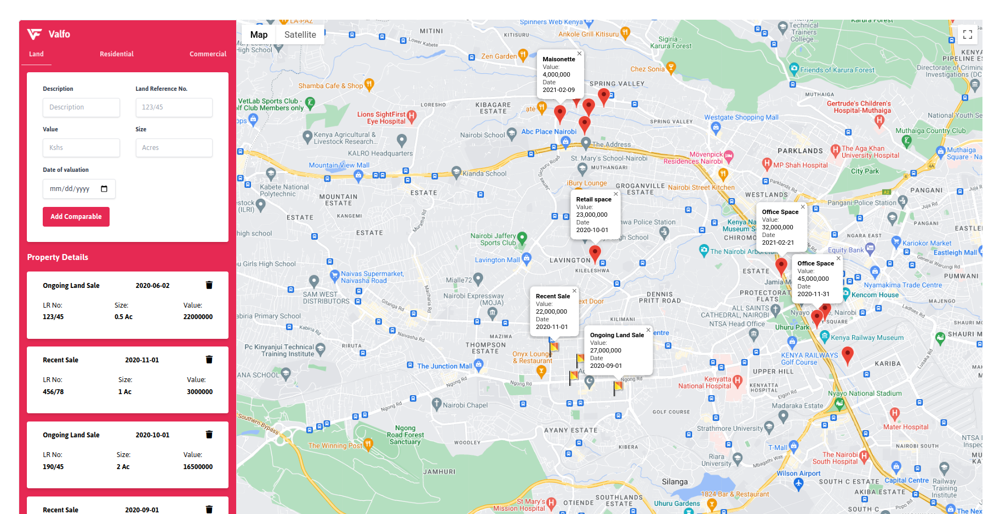

# Valfo Map Application
## By Dennis Kimathi

## Screenshot
 

 ## Table of Content
 - [Description](#description)
 - [Features](#features)
 - [Design Driven Development](#Design-Driven-Development)
 - [Requirements](#requirements)
 - [Installation Process](#installation-Process)
 - [Live Link](#Live-Link)
 - [Technology  Used](#technology-Used)
 - [License](#license)
 - [Authors Info](#Authors-Info)

## Description

Valfo is a web application that helps valuers get comparables easily.

[Go Back to the top](#Valfo-Map-Application)
## Features

1. As a valuer, I want to see data on a particular property displayed on a map
2. As a valuer, I want to  click on a map and add property information to be displayed on a map.

[Go Back to the top](#Valfo-Map-Application)

## Design Driven Development

Use the link to find the project design.

Figma Design -[Valfo-Map-Application](https://www.figma.com/file/Aycibqlg8MyOG1jUykOD3l/Valfo?node-id=503%3A50)

[Go Back to the top](#Valfo Map Application)

 ###  Requirements
 * Access to  a computer or any other garget
 * Access to internet

 ### Installation Process
 ****
* Clone to the repo : git clone https://github.com/DennohKim/valfo-map-app.git
* Unzip the downloaded files in a folder of choice.
* Open the index file from the zipped file with any browser.
 ****
 [Go Back to the top](#Valfo-Map-Application)

### Live Link
- Click this link to view the live application https://dennohkim.github.io/valfo-map-app/

### Technology  Used
* HTML - which was used to develope the structure off the pages.
* TAILWINDCSS - which was used to style the User Interface.
* JAVASCRIPT - which was used for DOM(Document Object Manipulation) scripts and communicating with the server using the response/request cycle.
[Go Back to the top](#Valfo-Map-Application)

## Known Bugs
* Click event on marker does not pick coordinates.

## License
MIT License
Copyright (c) [2022] [License](LICENSE.txt)
Permission is hereby granted, free of charge, to any person obtaining a copy
of this software and associated documentation files (the "Software"), to deal
in the Software without restriction, including without limitation the rights
to use, copy, modify, merge, publish, distribute, sublicense, and/or sell
copies of the Software, and to permit persons to whom the Software is
furnished to do so, subject to the following conditions:
The above copyright notice and this permission notice shall be included in all
copies or substantial portions of the Software.
THE SOFTWARE IS PROVIDED "AS IS", WITHOUT WARRANTY OF ANY KIND, EXPRESS OR
IMPLIED, INCLUDING BUT NOT LIMITED TO THE WARRANTIES OF MERCHANTABILITY,
FITNESS FOR A PARTICULAR PURPOSE AND NONINFRINGEMENT. IN NO EVENT SHALL THE
AUTHORS OR COPYRIGHT HOLDERS BE LIABLE FOR ANY CLAIM, DAMAGES OR OTHER
LIABILITY, WHETHER IN AN ACTION OF CONTRACT, TORT OR OTHERWISE, ARISING FROM,
OUT OF OR IN CONNECTION WITH THE SOFTWARE OR THE USE OR OTHER DEALINGS IN THE
SOFTWARE.
[Go Back to the top](#Valfo Map Application)

## Authors Info
Slack Profile - [Dennis Kimathi](https://app.slack.com/client/T0101L740P4/C010E0J8BRA/user_profile/U03CYMSV3DZ)

LinkedIn - [Dennis Kimathi](https://www.linkedin.com/in/dennis-kimathi-46326711b/)
[Go Back to the top](#Valfo-Map-Application)